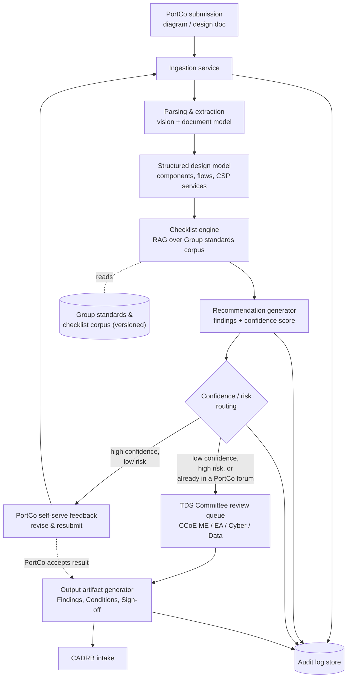
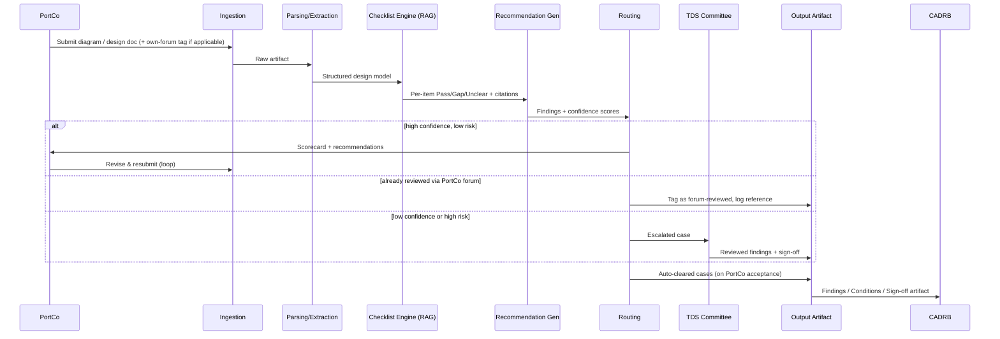

# AI-Assisted TDS Review Tool — Architecture Design

**Owner:** TDS Committee (CCoE Migration Enablement, EA, Cyber, Data) — joint accountability, not a single-owner system
**Status:** Exploratory design draft. An AI-assisted tool was raised as one idea during discussion (noted under Phase 4 of the TDS roadmap) — it is **not a decided or committed deliverable**. This document works out what such a tool could look like, so the option is ready to evaluate if and when the TDS Committee chooses to pursue it.
**Related:** TDS AI Requirements (companion doc)

---

## 1. Design Principles

1. **Checklist and Group standards are the source of truth, not the model.** The AI never relies on memorized/general knowledge of "typical" cloud practice — every finding is grounded in retrieval against the TDS Committee's actual, current checklist and Group standards (RAG), so it can't hallucinate policy that doesn't exist.
2. **AI drafts, a TDS Committee member signs.** Nothing reaches CADRB without an explicit human sign-off, even if AI auto-clears the PortCo-facing feedback loop.
3. **Every finding is traceable.** Each recommendation cites the exact checklist item and Group standard/policy clause behind it.
4. **Multi-cloud by design, phased in practice.** The tool must eventually review Azure, AWS, and GCP designs equally, matching the Group's multi-cloud strategy — built so AWS/GCP coverage is additive, not a redesign.
5. **Built for a small, joint team.** The TDS Committee is 4 staff (+2 shared) drawn from four groups (CCoE ME, EA, Cyber, Data) — the architecture should minimize what needs a human, and make the parts that do need one as fast as possible.
6. **Complements PortCo forums, doesn't replace them.** Where a PortCo already has AWG, ARC, DAC, Infra Day, etc., the tool should support "reviewed via their forum" rather than forcing a duplicate TDS pass.
7. **Sensitive input, careful handling.** Architecture diagrams can reveal security posture — this shapes the hosting and data-retention choices below.

---

## 2. High-Level Architecture

**Reading the diagram:** the PortCo interacts only with the ingestion step and the self-serve feedback loop; everything else is internal. The routing decision (G) is the only branch point, and it now includes a third condition — a project already being handled through a PortCo's own forum should route there rather than generate a duplicate TDS session.

---

## 3. Components

### 3.1 Ingestion Service
- Accepts diagrams (image/PDF/draw.io/Visio export) and documents (Word/PDF/markdown).
- Captures submission metadata: PortCo, project, target CSP(s), submitter, and — if applicable — which PortCo-owned forum (AWG, ARC, DAC, Infra Day, etc.) the project is also going through.
- Assigns a submission ID and stores the raw artifact in object storage.
- Supports early "register a project" intake at kick-off, addressing today's gap where new projects aren't visible to TDS until CADRB registration.

### 3.2 Parsing & Extraction (vision + document understanding)
- A multimodal model reads the diagram and any accompanying document.
- Output: a structured design model — components, data flows, network zones, CSP services identified, IAM roles, encryption/data handling, and cost-relevant sizing.
- Azure service patterns supported at launch; AWS and GCP patterns added as the Group's multi-cloud rollout proceeds (see §6).
- Low-confidence extraction is flagged rather than silently passed downstream.

### 3.3 Group Standards & Checklist Corpus
- The authoritative, versioned source of truth: the TDS checklist plus the underlying Group standards/policies across the finalized domains:
  - Cloud Architecture — Cloud Usage Guideline, Cloud Usage Policy, Group Cloud Architecture Standard
  - Security Standard — Group Cloud Security Standard, Group Information and Cybersecurity Policy
  - Network Standard — Group Network Security Standard
  - Data and AI — Group Data Security and Encryption Standard, Group AI Policy
  - IAM — Group IAM Standard
  - Observability / Cyber Log — Group Logging and Auditing Standard
  - Cloud Cost — no formal standard; advisory guidance toward lower-cost/higher-discount SKUs
- Indexed into a retrieval store (see §5) so the checklist engine can cite exact clauses.
- Owned and updated by the TDS Committee jointly, independently of the AI pipeline — a standards update or new CSP's service catalog does not require touching model logic.

### 3.4 Checklist Engine (RAG)
- For each checklist item, retrieves the relevant standard clause(s) and evaluates the structured design model against it.
- Produces a per-item result: Pass / Gap / Unclear, each with a citation back to the source clause. Cloud Cost is always advisory, never a compliance Pass/Gap.

### 3.5 Recommendation Generator
- Turns each Gap into a specific, actionable fix in plain language (not raw policy text).
- Assigns a confidence score per recommendation.
- Assembles the full scorecard for the submission, organized by domain.

### 3.6 Confidence / Risk Routing
- Configurable rule layer (not model logic) that decides: self-serve return vs. TDS Committee escalation vs. "already covered by PortCo forum."
- Risk factors are defined jointly by the TDS Committee (e.g. cross-border data, novel pattern, security-critical gap, low extraction/finding confidence).
- Kept as explicit, editable rules/config — not baked into a prompt — so policy changes don't require a model change.

### 3.7 TDS Committee Review Workflow
- Queue visible to whichever TDS Committee members are relevant to the escalation (CCoE Migration Enablement, EA, Cyber, or Data) — this is a shared queue across a joint committee, not a single team's inbox.
- Reviewer can accept, edit, or override any AI finding.
- Supports the proposed multi-session consult pattern (lighter, iterative touch-points) rather than one heavy formal session — and supports deferring to a PortCo's own forum session where one exists.

### 3.8 Output Artifact Generator
- Compiles the agreed minimum viable artifact: **Findings, Conditions, and Sign-off** (email sign-off at minimum; exact sign-off authority still open — see requirements doc §9).
- Produces a document (and/or structured data) consumable by CADRB, aimed at letting CADRB's short session focus on decisions rather than discovery.

### 3.9 Audit Log Store
- Immutable record of every submission, AI output, routing decision, and human decision, with the checklist version and target CSP(s) recorded.
- Answers, after the fact: did this solution go through TDS (or an equivalent PortCo forum), and what happened?

---

## 4. Data Flow (sequence view)

---

## 5. CSP Options (where to host the tool)

The tool must review designs across Azure, AWS, and GCP as the Group's multi-cloud strategy rolls out — that's independent of which CSP *hosts* the tool itself, and independent of the fact that Azure is the only currently-approved CSP. Four reasonable hosting options:

| Option | Notes | Considerations |
|---|---|---|
| **A. Azure** | Aligns with the Group's currently-approved CSP and existing landing zones; Azure OpenAI Service for the LLM layer; Azure AI Search for retrieval. | Fastest to stand up given today's approved footprint. As AWS/GCP get approved, the tool still needs to *review* those designs even while *hosted* on Azure — that's a data-flow question, not a blocker. |
| **B. AWS** | Amazon Bedrock provides model choice (including Claude, Llama, Titan) without managing infra; OpenSearch/Kendra for retrieval. | Worth reassessing once AWS is Group-approved, if PortCo AWS adoption grows. |
| **C. GCP** | Vertex AI offers strong native multimodal models (Gemini), which may help with messy/hand-drawn diagram parsing. | Introduces a new CSP relationship for this tool alone; likely premature before GCP is Group-approved. |
| **D. CSP-agnostic (containerized + model gateway)** | Run the pipeline in containers (any CSP or on-prem), call AI models via an abstraction layer (e.g. LiteLLM, a model gateway) rather than binding to one vendor's SDK. | Highest flexibility and avoids lock-in — particularly relevant here since the Group itself is moving from single-cloud to multi-cloud; keeps the hosting decision independent of the CSP-approval roadmap. |

**Suggested default for a pilot:** Option A (Azure), since it's the currently-approved CSP and fastest to integrate with existing Group infrastructure — built with a thin abstraction layer (as in Option D) so the tool doesn't need to be rebuilt when AWS/GCP are approved and reviewed designs start arriving from those CSPs. This is a starting recommendation, not a decision — confirm with Cyber/ISO and whoever owns the multi-cloud rollout timeline.

---

## 6. AI Model Options (the reasoning/vision layer)

| Option | Multimodal (diagram reading) | Strengths for this use case | Notes |
|---|---|---|---|
| **Azure OpenAI Service (GPT-4.1 / GPT-5 class)** | Yes | Strong general vision + text reasoning; tight Azure integration (private endpoints, no training-data retention on enterprise tier). | Natural fit given Azure is the currently-approved CSP (Option A above). |
| **Amazon Bedrock (Claude, via AWS)** | Yes | Claude models are strong at long-document reasoning, structured output, and following detailed checklist-style instructions; available in Bedrock with enterprise data controls. | Worth evaluating once AWS is Group-approved, or callable via API even before full AWS adoption if hosting stays CSP-agnostic (Option D). |
| **Anthropic API directly (Claude)** | Yes | Same model strengths as above without going through a CSP's managed AI service; useful if the CSP-agnostic hosting option (D) is chosen. | Requires its own data-handling/vendor agreement separate from a CSP contract. |
| **Google Vertex AI (Gemini)** | Yes | Particularly strong at reading complex/dense visual layouts, which can help with messy hand-drawn or exported diagrams. | Worth evaluating once GCP is Group-approved. |
| **Open-weight models (e.g. Llama-vision class), self-hosted** | Varies | Full control over data residency and no per-call vendor cost at scale. | Higher engineering/ops burden for a 4-person team; harder to match closed-model accuracy on nuanced checklist reasoning today. |

**What matters most for this use case, regardless of pick:**
- **Enterprise data terms**: no training on submitted data, private/regional endpoints, encryption in transit and at rest.
- **Multimodal quality**: the diagram-parsing step is the accuracy bottleneck for the whole pipeline — worth piloting 2–3 models on a sample of real PortCo diagrams before committing.
- **Structured output support**: the model must reliably return structured findings (JSON-like schema) for the checklist engine to consume, not free-form prose.
- **Grounded citation behavior**: the model needs to reliably cite the retrieved standard clause rather than paraphrasing from memory — this should be part of the pilot evaluation, not assumed.

**Suggested approach:** pilot with the model that pairs naturally with the currently-approved CSP (Azure OpenAI), but build the integration behind a model-abstraction layer so a second model — and eventually AWS/GCP-native options — can be evaluated without reworking the pipeline.

---

## 7. Retrieval (RAG) Layer Options

| Option | Notes |
|---|---|
| **Azure AI Search** | Natural fit given Azure is the currently-approved CSP; supports hybrid keyword + vector search. |
| **Amazon OpenSearch / Kendra** | Worth evaluating once AWS is Group-approved. |
| **Google Vertex AI Search** | Worth evaluating once GCP is Group-approved. |
| **Open-source (pgvector, Qdrant, Weaviate)** | CSP-agnostic; more control, more operational responsibility; suits the containerized/model-agnostic hosting option and matches the Group's move toward multi-cloud. |

The checklist and Group standards corpus should be **chunked and versioned deliberately** (not just dumped in as raw PDFs), so a standard update only requires re-indexing the affected chunks, and every finding can cite a specific, stable clause reference. Adding AWS/GCP-specific guidance later should be additive to this corpus, not a rebuild.

---

## 8. Deployment & Security Considerations

- **Data sensitivity**: architecture diagrams can reveal security posture (network topology, IAM structure). Use private/enterprise-tier endpoints only — no public/shared consumer AI endpoints, no data used for vendor model training.
- **Data residency**: store submissions, extracted models, and logs within the region/tenant required by Group data policy.
- **Access control**: role-based access — PortCo submitters see only their own submissions; TDS Committee members (across CCoE ME, EA, Cyber, Data) see the review queue and audit logs relevant to their domain.
- **Network isolation**: ingestion and storage should sit inside the Group's private network (VNet/VPC), with the AI model call made via private endpoint/peering where the chosen vendor supports it.
- **Retention policy**: define how long raw diagrams/documents and AI outputs are retained, separate from the audit log (which likely needs longer retention for compliance/traceability).
- **Model/vendor swap-ability**: keep the model call, retrieval call, and checklist logic behind clean internal interfaces — this matters more than usual here, since the Group is actively expanding its own CSP footprint.

---

## 9. Proposed Implementation Roadmap (for this AI tool specifically)

The TDS Committee's own phased rollout (Align & Scope → Build → Pilot → Launch → multi-cloud extension) was drafted before this AI-assisted tool idea existed as a real proposal — it only notes "develop tools that help PortCos enable TDS easily" as a discussion point, not a planned workstream. Rather than force-fit this tool into that roadmap and risk confusing the two, here is a standalone roadmap for the AI tool itself, on the assumption it moves forward as its own initiative:

| Stage | Focus | Dependency |
|---|---|---|
| **Stage 0 — Decision & scoping** | TDS Committee decides whether to pursue this tool at all; confirms hosting CSP and AI model direction (§5–§6); confirms data-handling terms with Cyber. | None — this can start any time. |
| **Stage 1 — Checklist readiness** | Confirm the TDS checklist (domains in §3.3) exists in a structured, versioned form suitable for RAG — not just prose documents. | Depends on the TDS Committee's own checklist-authoring work; this tool cannot meaningfully start before the checklist is at least in a stable draft. |
| **Stage 2 — Core pipeline build** | Build ingestion, parsing/extraction, checklist engine (RAG), and recommendation generator against Azure patterns first. | Depends on Stage 1. |
| **Stage 3 — Routing & review workflow** | Implement confidence/risk routing rules with TDS Committee input; build the review queue and sign-off flow. | Depends on Stage 2 and on sign-off authority being resolved (open item in requirements doc §9). |
| **Stage 4 — Internal pilot** | Run the tool against a small set of real (anonymized) past or in-flight submissions, without PortCos in the loop yet, to validate extraction and recommendation accuracy. | Depends on Stage 3. |
| **Stage 5 — PortCo pilot** | Run with a small set of volunteer PortCos, ideally including at least one project already going through a PortCo-owned forum (AWG/ARC/DAC/Infra Day) to validate the "avoid duplicate review" path. | Depends on Stage 4. |
| **Stage 6 — Rollout** | Make available alongside the TDS Committee's own engagement channels (CWG announcement, mail group, per-PortCo chats). | Depends on Stage 5, and on the TDS Committee's own launch/announce work having already established those channels. |
| **Stage 7 — Multi-cloud extension** | Extend checklist coverage and diagram parsing to AWS and GCP as those CSPs are Group-approved. | Depends on the Group's multi-cloud approval timeline, not on this tool's own progress. |

This roadmap is intentionally decoupled from the TDS Committee's phase numbering to avoid implying the two were planned together — they weren't. If the TDS Committee later decides to formally fold this tool into its own roadmap, Stage 1 onward would most naturally slot in around or after the Committee's own "Build" phase, since both depend on the same checklist being ready.

---

## 10. Risks & Mitigations

| Risk | Mitigation |
|---|---|
| AI hallucinates policy that doesn't exist | Ground every finding in RAG citation to actual checklist/Group standards text; reject/flag any finding without a valid citation. |
| Diagram parsing accuracy varies with format/quality | Pilot across real diagram formats before GA; publish an optional lightweight diagram template; flag low-confidence extractions instead of guessing. |
| PortCo treats "AI passed" as equivalent to CADRB approval | Make this explicit in every PortCo-facing output; the artifact should clearly state its status (self-serve auto-clear vs. TDS Committee-reviewed). |
| Sensitive architecture data exposed to a third-party AI vendor | Enterprise/private endpoints only, no training-data retention, data residency confirmed with Cyber before go-live. |
| Standards change, or AWS/GCP get approved, and the checklist/corpus goes stale | Version the corpus; require a defined owner/process for updating it whenever a standard changes or a new CSP is added. |
| Tool built ahead of a stable checklist | Sequence the build so Stage 2 doesn't start until the checklist is at least stable-draft, per the roadmap in §9. |
| Small, joint team (4 staff, +2 shared) can't sustain review queue even with AI | Keep routing thresholds conservative at first (favor escalation over auto-clear) and tighten only as confidence in AI accuracy grows from real pilot data. |
| Tool duplicates a PortCo's own forum review | Support forum-tagging on submissions (§3.1, §4.9 in requirements) so a project already reviewed via AWG/ARC/DAC/Infra Day isn't re-run through TDS from scratch. |
| Vendor/CSP lock-in | Keep model calls and retrieval behind an abstraction layer from day one, even if Phase 1–3 targets Azure only for speed. |

---

## 11. Decisions Needed From Stakeholders

1. Which CSP hosts the tool (§5) — Azure (matching current approval), or a CSP-agnostic containerized approach from the start given the multi-cloud roadmap?
2. Which AI model(s) to pilot first (§6), and whether a second model will be A/B tested before GA.
3. Confirm data-handling/retention terms with Cyber for whichever vendor is chosen.
4. Confirm sign-off authority for the output artifact (open item from requirements doc §9).
5. Sequencing: does the TDS Committee want this tool built as a standalone initiative (per the Stage 0–7 roadmap in §9), or formally folded into its own phased rollout — and if the latter, at what point does checklist authoring need to be "stable enough" to start Stage 2?
6. Relationship between this AI tool and the separate "reference architecture" workstream mentioned in Phase 4 — same team, same tool, or parallel efforts?
