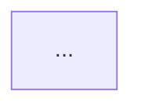

# Reference Design Template Format

Defines the plain-text format TDS Committee members author reference design templates in (requirements doc §4.10, architecture doc §3.10). One file per template, committed to `templates/<template-id>/template.md`, with the diagram alongside it. Diagram/pattern only — **never IaC** (requirements doc, non-goals).

## File location

```
templates/
  azure-webapp-pii-001/
    template.md
    diagram.mmd          # Mermaid source, preferred — renders in GitHub and is diffable
    diagram.png           # optional rendered export, for PortCos who want an image
  azure-batch-pipeline-001/
    template.md
    diagram.mmd
```

Each template gets its own folder (template ID as folder name) so the diagram lives next to its description and both version together in the same commits.

## Frontmatter schema

```yaml
---
id: azure-webapp-pii-001                # required, unique, stable across edits
title: "Azure web app handling customer PII"   # required
target_csp: azure                       # required: azure | aws | gcp
data_sensitivity: [pii, confidential]   # required, one or more: public, internal, confidential, pii, restricted
integration_patterns: [on-prem-vpn, rest-api]  # required, free-form tags describing integration shape
regulatory_scope: financial             # required: financial | none — whether THIS WORKLOAD carries financial-regulatory obligations (BOT/SEC/AMLO-style audit depth, data residency, transaction logging), independent of which PortCo builds it and independent of data_sensitivity. Only set financial if the pattern's satisfies list or diagram actually differs because of it — don't use this field as a stand-in for "has PII" (that's data_sensitivity's job).
pci_scope: out-of-scope                 # required: cde | cde-adjacent | out-of-scope — drives network segmentation and encryption requirements; the matching engine filters on this BEFORE semantic matching (a PCI requirement must never match an out-of-scope template)
status: active                          # required: active | needs-revalidation | retired
version: 1                              # required, integer
checklist_version_validated_against: 1  # required — the checklist version (see docs/CORPUS_BUILD_PIPELINE.md) this template was last validated against; the build pipeline uses this to detect drift for FR-46
last_updated: 2026-07-31                # required, ISO date

# The critical cross-reference for FR-46 (re-validation flagging): which specific
# checklist items this template satisfies out of the box, by domain.
satisfies:
  cloud-architecture: [CA-001, CA-003]
  security: [SEC-001]
  network: [NET-001, NET-002]
  data-ai: [DAI-001]
  iam: [IAM-001]
  observability: [OBS-001]
  # cloud-cost intentionally omitted from "satisfies" — cost is always advisory (FR-9),
  # never a compliance item a template can "satisfy"
---
```

**On `regulatory_scope` vs. `data_sensitivity`:** these are separate axes, not synonyms. `data_sensitivity` describes what kind of data flows through the pattern (PII, confidential, etc.) and typically does drive real architecture differences (encryption, access controls). `regulatory_scope` describes whether the workload itself is subject to financial-regulatory obligations *beyond* what its data sensitivity already implies. Before adding `regulatory_scope: financial` to a template — or splitting one template into two by this field — check whether it actually changes the `satisfies` list or the diagram. If the only thing that would change is which company happens to be building it, don't split; let the matching engine's residual-gap flow (FR-36) surface any extra checklist items a specific financial submission needs, rather than duplicating the whole template. See `docs/TEMPLATE_LIBRARY_PLAN.md` for how this plays out across the initial set.

## Body sections (Markdown, in this order)

````markdown
## Pattern Description

Plain-language description of the architecture pattern and when it fits —
what kind of PortCo requirement should match to this template (FR-34's
matching engine uses this alongside the frontmatter for retrieval).

## Diagram

Reference to `diagram.mmd` (Mermaid) rendered inline, or embed directly:



## What's Pre-Approved

Restates the `satisfies` frontmatter list in plain language — which checklist
domains/items this template already satisfies, so a PortCo doesn't have to
guess (FR-35).

## What You Still Decide

Explicitly lists what remains the PortCo's decision: SKU sizing, naming
conventions, project-specific IAM role assignments, scaling parameters, etc.
(FR-35). This section is what prevents "AI passed" from being mistaken for
"fully done" (architecture doc §10 risk).

## Notes (optional)

Known limitations, common customization pitfalls, or links to related templates.
````

## Editing rules

(For *which* templates to author and in what order, see `docs/TEMPLATE_LIBRARY_PLAN.md`.)

- **New template**: new folder + new unique ID. Must declare `checklist_version_validated_against` matching the checklist version at authoring time — the TDS Committee is expected to have checked it against the current checklist domains listed in `satisfies` before committing.
- **Modify template**: edit in place, bump `version`. If the change doesn't touch `satisfies` or the underlying pattern's compliance posture, `checklist_version_validated_against` can stay as-is.
- **Retire template**: `status: retired`, keep the file for history (same rationale as checklist items).
- **Re-validation flag** (FR-46, automatic): the build pipeline compares each template's `satisfies` list against which checklist item IDs changed since `checklist_version_validated_against`. If any overlap, the pipeline sets `status: needs-revalidation` in a follow-up PR/comment and opens a tracking issue — it does **not** silently change the template content or the compliance judgment itself. A TDS Committee member reviews, re-validates (updating `checklist_version_validated_against` and `status: active`), or revises the pattern.
- **PR review**: same `CODEOWNERS`-enforced TDS Committee approval as checklist items.
